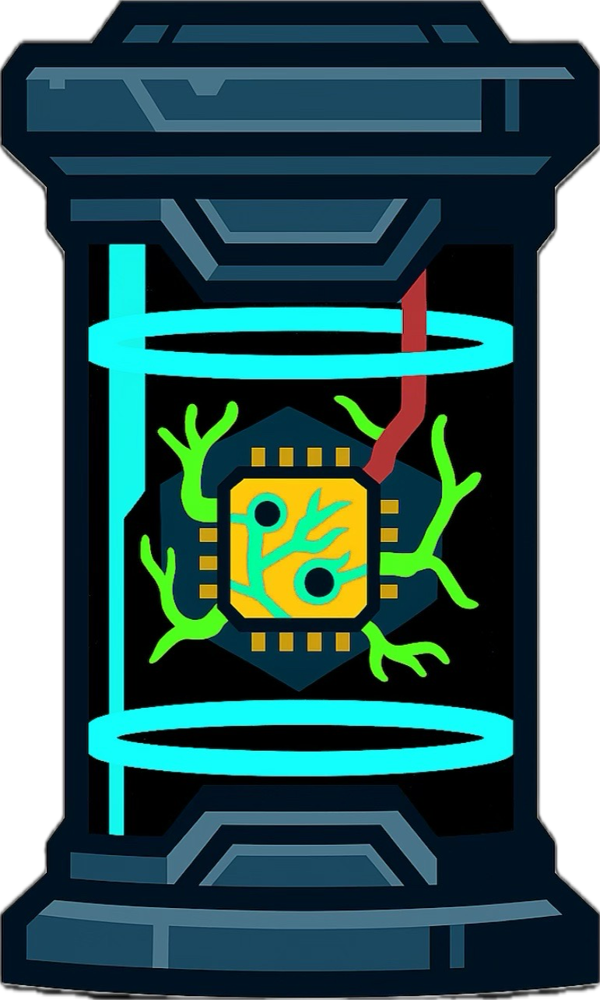

# Canister

  

Canister is a containerized environment where an agent reside, designed for recursive self-improvement experimentations.

## Overview
Canister agent is a coding agent engineered for self-improvement within a canister—a safe, controlled environment.
It now ships with a core observability spine, structural index, capability registry, planner/executor/evaluator scaffolding, and a prompt repository as documented in `docs/self_referential_architecture.md`. These components lay the groundwork for combinatorial self-optimization (prompts, code, components, architecture) driven by telemetry and policy feedback loops.

## Key Features

- **Structural Memory** (`agent/core/structure_index.py`): Incremental, telemetry-aware codebase snapshotting with dependency graphs.
- **Capability Registry** (`agent/core/capabilities.py`): Catalog of tools/capabilities, registered at bootstrap for planner consumption.
- **Planner & Executor Scaffolding** (`agent/core/planner.py`, `agent/core/executor.py`): Generate and execute improvement plans with telemetry instrumentation.
- **Evaluator (stub)** (`agent/core/evaluator.py`): Hook for automated gating (tests, lint, prompt regressions) prior to adopting changes.
- **Prompt Repository** (`agent/core/prompt_repository.py`): Versioned prompt management with staging/promote/rollback operations.
- **Planning Tools** (`agent/tools/planning_tools.py`): ADK-compatible interfaces for plan generation, execution, and prompt administration.
- **Telemetry Spine** (`agent/core/telemetry.py`): Unified event logging to `.agent_state/telemetry.jsonl`.

## License

See [LICENSE](LICENSE) for full terms.

Copyright © 2025 Thant Min Htet. All rights reserved.

## Contact

For licensing inquiries or permission requests contact **Min Htet, Thant**.

*Usage rights are not granted until appropriate safety and security measures are in place.*
