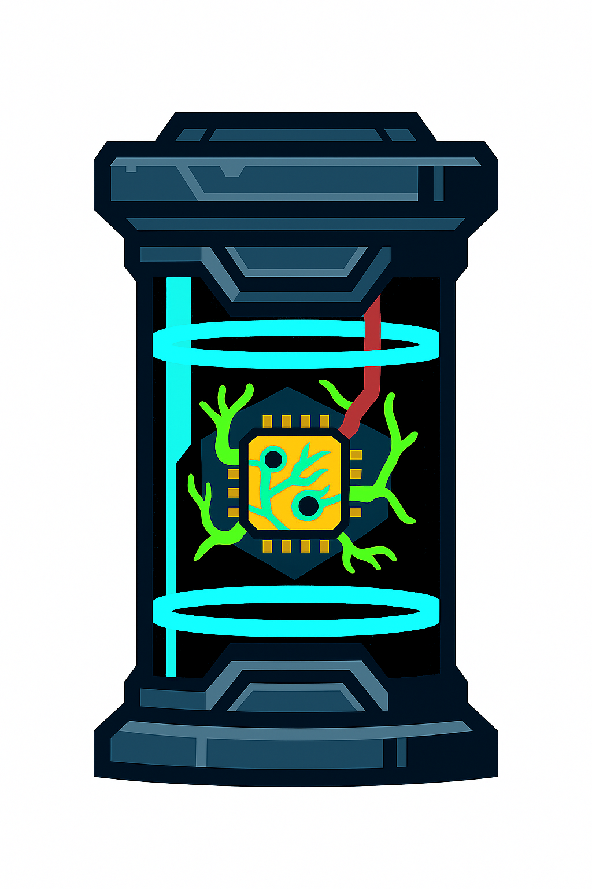

  

# Canister
Canister is a containerized environment where agents reside, designed for recursive self-improvement and experimentation.

## Overview
Canister agent is a coding agent engineered for self-improvement within a canister which is safe and controlled environment.
It features AST-based code merging and comprehensive codebase indexing, intelligent analysis, transformation, and manipulation of source code.

## Key Features

- **AST-Based Code Merging**: Intelligently merge LLM-generated code snippets into existing Python files
- **Codebase Indexing**: Deep understanding and navigation of codebases with searchable knowledge bases
- **Self-Awareness**: Agent can analyze its own capabilities and structure
- **Code Analysis**: Comprehensive code structure analysis and dependency mapping
- **File Operations**: Advanced file system operations and terminal command execution
- **Docker Integration**: Sandboxed code execution in Docker containers

## License

See [LICENSE](LICENSE) for full terms.

Copyright © 2024 Thant Min Htet. All rights reserved.

## Contact

For licensing inquiries or permission requests:
- **Author**: Min Htet, Thant
- **Email**: thant.mht@gmail.com

---

*This repository is for demonstration and reference purposes only. No usage rights are granted.*
