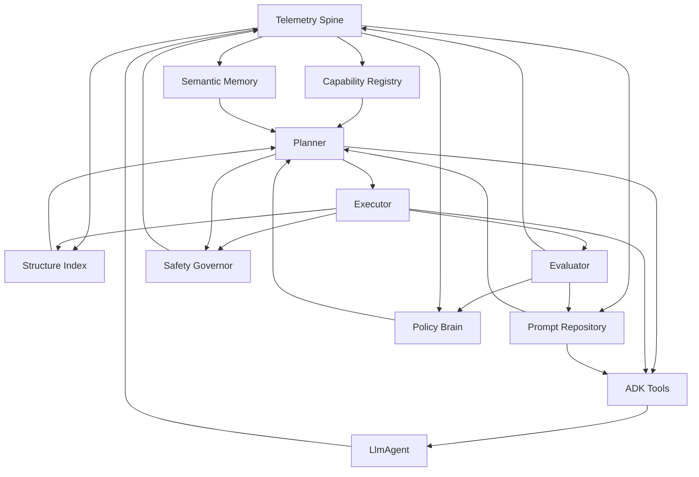

# Self-referential Architecture Blueprint

This document outlines the target architecture and implementation plan required to transform the agent into a self-improving system. Components are grouped into core "organs" with responsibilities, key collaborations, and concrete implementation tasks.

## Architecture Overview

Telemetry captures activity across services, knowledge stores feed the planner, and plans flow through executor and evaluator before surfacing via ADK tools to the agent. Telemetry closes the loop for continuous improvement.

## 1. Observation Spine
- **Purpose**: Capture every significant event (tool invocation, plan step, test result, anomalies) with timing and outcome metadata.
- **Key Modules**: `agent/core/telemetry.py`, optional async worker (`TelemetryWorker`) writing JSONL/SQLite.
- **Implementation Tasks**
  - Define `TelemetryEvent` dataclass (timestamp, event_type, payload).
  - Provide `TelemetryClient.log_event()` and `TelemetryClient.flush()`. ✅ (`agent/core/telemetry.py`)
  - Instrument existing tools (indexer, mergers, memory engine) to emit events at start/finish/error. ✅ (`StructureIndex`, `MemoryEngine`, and `ProfessionalSWEMerger` now emit detailed telemetry.)
  - Record LLM request/usage metrics (token counts, stream flag) through a LiteLLM wrapper. ✅ (`agent/core/llm_instrumentation.py`)
  - Add configuration for sinks (file, stdout, future metrics backend).

## 2. Capability Registry
- **Purpose**: Maintain an authoritative catalog of tools, skills, and constraints so planners can reason about what the agent can do safely.
- **Key Modules**: `agent/core/capabilities.py`, persistence under `.agent_state/capabilities.json`.
- **Implementation Tasks**
  - Create dataclasses: `ToolCapability`, `Skill`, `Constraint`.
  - Bootstrap registry during `agent.create_agent()` by scanning tool metadata. ✅ *(initial tool registration wired into `agent/agent.py` using `TOOL_REGISTRY_DEFINITIONS`)*
  - Expose `registry.capable_of(task)` and `registry.requirements_for(tool_name)`.
  - Emit telemetry when capabilities change (added/removed/updated). ✅ *(register/remove now log to telemetry).*

## 3. Structural Memory
- **Purpose**: Provide an up-to-date structural snapshot of the codebase (symbols, dependencies, diagnostics).
- **Key Modules**: Replace `CodebaseIndexer` internals with service `agent/core/structure_index.py`.
- **Implementation Tasks**
  - Integrate incremental updater (hash/mtime watchdog) feeding the SQLite index or LSP cache.
  - Normalize dependency keys (module ↔ file mapping) and ensure stale entries are pruned. ✅ module/file resolution now stored per dependency.
  - Offer query API (`symbols(name)`, `dependencies(path)`, `references(symbol)`).
  - Connect to telemetry for refresh statistics (duration, files touched). ✅ basic start via `structure_index.index_*` events.
  - Baseline caching implemented (`StructureIndex`) with hash reuse + stale entry purge; watchdog remains TODO for real-time updates.

## 4. Semantic Memory
- **Purpose**: Store contextual knowledge about past tasks, discussions, and explanations for retrieval-guided planning.
- **Key Modules**: `agent/core/semantic_memory.py`, vector store (FAISS/local DB).
- **Implementation Tasks**
  - Define `Episode` schema (goal, context, actions, result, embeddings).
  - Implement `SemanticMemory.retrieve(query, top_k)` and `SemanticMemory.store(episode)`.
  - Hook telemetry pipeline to log episodes once evaluator reports success/failure.
  - Plan for fallback to lightweight embedding cache if vector backend unavailable.

## 5. Prompt Repository
- **Purpose**: Track, version, and evaluate the prompts that guide agent behaviour (system prompts, tool instructions, merge guidance).
- **Key Modules**: `agent/core/prompt_repository.py`.
- **Implementation Tasks**
  - Define prompt metadata schema (id, version, owning capability, evaluation history, usage metrics). ✅ (implemented in repository.)
  - Add planner/executor flows for prompt improvements (draft -> evaluate -> stage -> release) with telemetry and rollback. ✅ (planner + executor now manage stage/evaluate/promote with telemetry.)
  - Integrate evaluator with prompt-specific suites (scenario replays, A/B tests, hallucination checks). 🔄 Structural + quality heuristics implemented; behavioural suites remain TODO.
  - Expose prompt retrieval/history (`get`, `history`) through the prompt repository ADK tool so the agent can inspect stored templates directly. ✅ (`agent/tools/planning_tools.py`)
  - Bootstrap default system prompt content during agent startup so prompt operations have an initial target. ✅ (`agent/agent.py`)
  - Emit telemetry per prompt version and maintain policy rules for promotion/demotion.

## 6. Planner
- **Purpose**: Translate high-level goals into executable plans, selecting tools and ordering steps.
- **Key Modules**: `agent/core/planner.py`.
- **Implementation Tasks**
  - Define `Plan` and `PlanStep` data structures (preconditions, action, expected outcome). ✅ (`agent/core/planner.py`)
  - Implement planning loop: goal intake → capability check → semantic retrieval → plan synthesis. ✅ (baseline loop selects tools via capability tags; semantic memory integration remains TODO.)
  - Include feedback hooks to replan when evaluator reports failure.
  - Publish plan lifecycle events via telemetry (generated, executing, completed). ✅ (`planner.create_plan.*` events)

## 7. Executor
- **Purpose**: Reliably carry out plan steps (file edits, commands, API calls), managing state and reporting progress.
- **Key Modules**: `agent/core/executor.py`.
- **Implementation Tasks**
  - Support action types: `ApplyPatch`, `RunCommand`, `InvokeTool`, `UpdateRegistry`. (Scaffold present; concrete dispatching TBD.)
  - Integrate with safety governor before executing high-risk steps.
  - Update structural memory after code modifications.
  - Emit detailed telemetry (duration, exit codes, diffs). ✅ (`executor.execute_*` events)

## 8. Evaluator
- **Purpose**: Validate outcomes using automated checks before adoption.
- **Key Modules**: `agent/core/evaluator.py`, configuration `config/evaluator.yml`.
- **Implementation Tasks**
  - Implement plug-in checks (tests, lint, type-check, benchmarks) with timeouts.
  - Provide `EvaluationReport` consumed by planner and policy brain. ✅ (stub provided; checks currently placeholders.)
  - Ensure evaluator runs automatically after executor finishes a plan segment.
  - Record historical pass/fail metrics for trend analysis.

## 9. Policy Brain
- **Purpose**: Adjust agent strategies based on telemetry (tool reliability, success rates, latency).
- **Key Modules**: `agent/core/policy.py`.
- **Implementation Tasks**
  - Aggregate telemetry into rolling metrics (per-tool success, average evaluation score).
  - Surface policy decisions (e.g., prefer `enhanced_ast_merger` when success > threshold).
  - Persist policy state and reload during bootstrap.
  - Provide hooks for manual overrides via configuration.

## 10. Safety Governor
- **Purpose**: Enforce guardrails, manage approvals, and handle automatic rollback.
- **Key Modules**: `agent/core/safety.py`.
- **Implementation Tasks**
  - Define risk scoring (diff size, sensitive paths, tests coverage).
  - Intercept executor actions; block or require confirmation when risk exceeds bounds.
  - Implement rollback helpers (git reset branch, restore files from structural memory snapshot).
  - Send alerts through telemetry when interventions occur.

## 11. Integration & Bootstrap
- **Purpose**: Wire all organs together and expose user-facing tools.
- **Implementation Tasks**
  - Update `agent/agent.py` to initialize telemetry, load capability registry, and connect planner/executor/evaluator.
  - Register new tools: `self_assessment_tool`, `improvement_planner_tool`, `policy_status_tool`.
  - Add CLI/script entry points for self-improvement runs (`python -m agent.self_upgrade --goal "improve tests"`).
  - Ensure tests cover each organ individually and in end-to-end flows.

## Implementation Sequencing
1. **Observation Spine + Structural Memory Refresh** (foundation for visibility and current-state awareness).
2. **Capability Registry** (enables planning decisions).
3. **Planner & Executor** (minimal loop with safety checks). ✅ (scaffolded; safety hooks pending.)
4. **Evaluator** (gating before changes persist).
5. **Prompt Repository** (centralized prompt management + evaluation).
6. **Semantic Memory & Policy Brain** (learning layer for iterative improvement).
7. **Safety Governor Enhancements** (risk scoring and rollback).

## Immediate Next Steps
- Begin Phase 1 tasks: draft experiment registry schema and unit-test harnesses for telemetry, planner, executor, and evaluator.
- Prototype executor action handlers (ApplyPatch, PromptUpdate, RunCommand) behind safety checks and wire them to the planner-generated steps.
- Implement the first evaluator runners (pytest smoke suite, lint) and integrate them into the executor → evaluator hand-off.
- Connect the planner/executor to the prompt repository tooling so staged prompt versions and promotions can be managed automatically during experiments.

## Improvement Combination Strategy
- **Prompt Layer**: Version prompts in the repository, run targeted evaluation suites (scenario replays, hallucination audits), and gate promotion/rollback via telemetry + policy thresholds.
- **Code Layer**: Use planner/executor to apply code edits, with evaluator enforcing lint/tests/regression suites before adoption.
- **Component Layer**: Compose multi-step plans (e.g., code change + prompt update) with tailored evaluation bundles; store experiment metadata in telemetry for comparison.
- **System/Architecture Layer**: Stage disruptive changes (new memory backend, planner overhaul) with phased evaluations (unit → integration → shadow runs) and safety-governed rollouts.
- **Experiment Matrix**: Maintain metadata describing the combination under test (prompt version, tool version, config flags). Evaluator consumes this to select check suites and telemetry logs results for policy learning.
- **Policy Feedback**: Policy brain ingests experiment outcomes, adjusts preferred prompt/code/component combos, and schedules replans for underperforming variants.

## Phased Self-Optimization Roadmap

**Phase 1 – Experiment Foundations**
- **Experiment Registry**: Implement `agent/core/experiment_registry.py` to record goals, combinations tried, evaluator metrics, and outcomes.
- **Planner Enhancements**: Extend planner to accept `ImprovementGoal` objects, embed combination metadata in plans, and pre-register experiments.
- **Executor Action Handlers**: Build concrete handlers for code edits, prompt updates, configuration toggles; route them through the Safety Governor (even if stubbed) and log diffs to the registry.
- **Evaluator Bootstrap**: Add wrappers for pytest/lint/type-check runners and normalize results into comparable fitness scores.

**Phase 2 – Policy & Safety Intelligence**
- **Policy Brain**: Aggregate telemetry + experiment metrics, choose next goals (UCB/ε-greedy/Bayesian strategies), and manage exploration vs. exploitation.
- **Safety Governor**: Introduce risk scoring, approval thresholds, and rollback routines (prompt demotion, git restores) tied into executor/evaluator events.
- **Semantic Memory Hooks**: Persist embeddings of experiments/outcomes to accelerate future planning and avoid repeating bad combinations.

**Phase 3 – Continuous Orchestration**
- **Goal Manager / Scheduler**: Monitor telemetry alerts, policy recommendations, and manual queues to produce a prioritized stream of improvement goals.
- **Self-Orchestrator Loop**: Implement a background runner that processes goals end-to-end (plan → execute → evaluate → log → policy) with retry/backoff logic and alerting on repeated failures.
- **Observability Dashboards**: Surface experiment status, prompt/code versions, and success metrics for auditing and debugging.

**Phase 4 – Advanced Optimization & Rollout**
- **Search Strategy Upgrades**: Layer Bayesian optimization or bandit algorithms on top of policy decisions for multi-layer combinations.
- **Layered/Cost-Aware Experiments**: Automate staged workflows (prompt-first, then code) and prioritize cheaper checks before expensive suites.
- **Rollout & Governance**: Implement canary/shadow deployments for high-impact changes, document approval procedures, and keep automated rollback hooks active.
- **End-to-End Validation**: Create integration tests that simulate full self-improvement cycles (prompt + code + policy) on controlled repos to ensure stability before production use.
